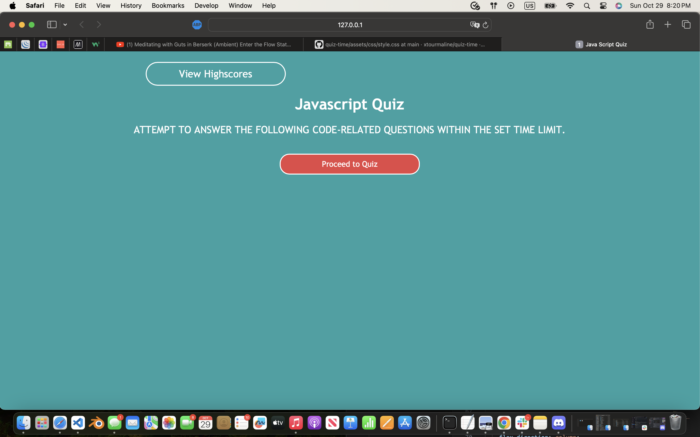
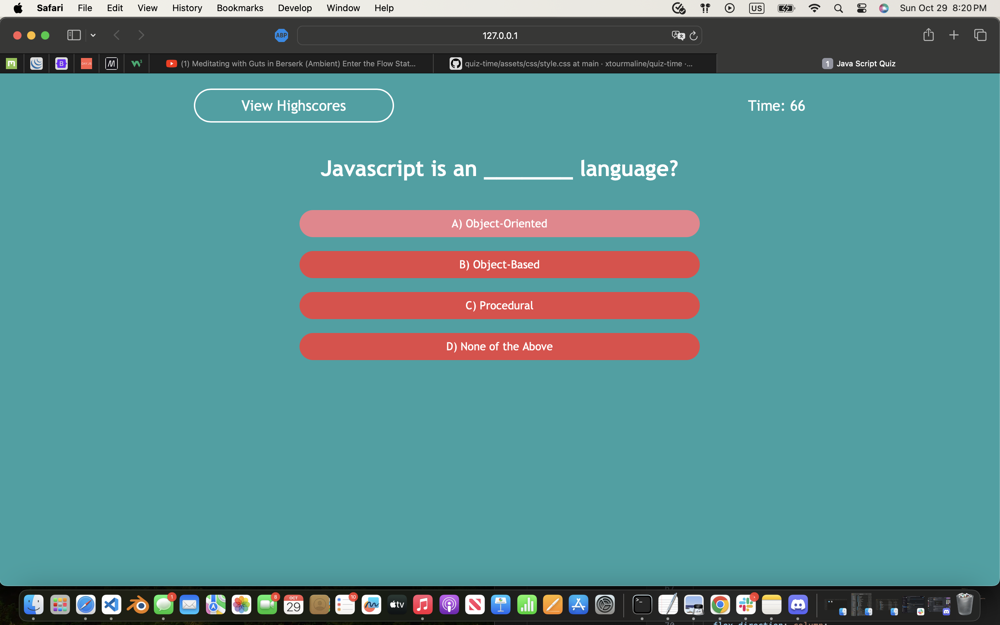
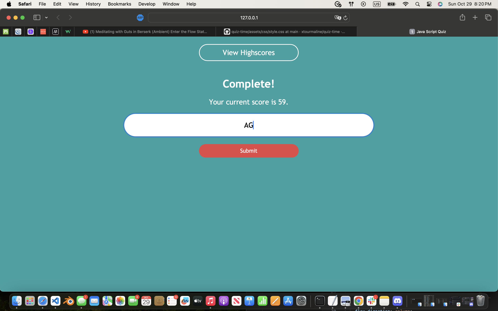
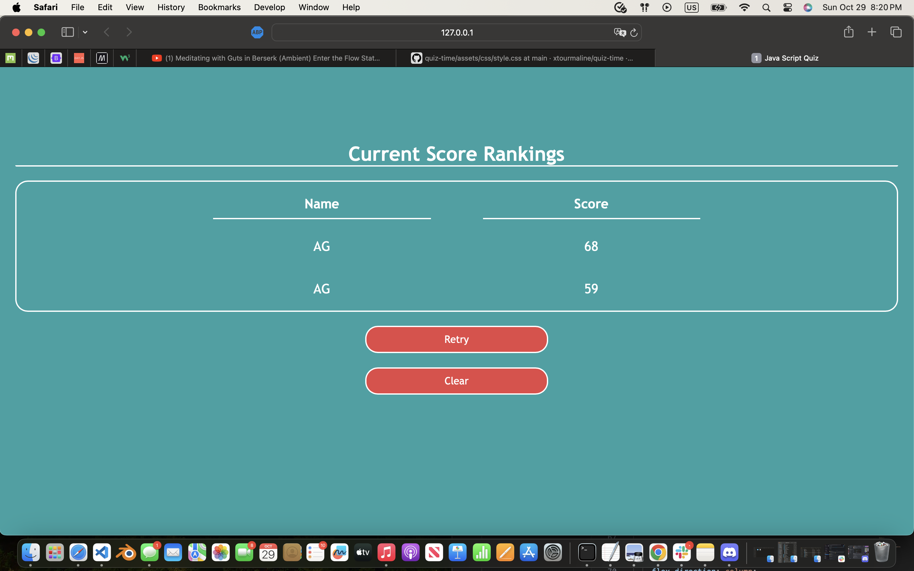

# Javascript Multiple Choice Quiz 

## Description 
In this repository the user can acces the quiz by clicking on the start button in the center of page. Once the quiz starts, a timer appears counting down from 75 seconds. The user has until the timer reaches zero to finish the JS Quiz. Once the user has completed the quiz, they will be sent to the end page and prompted to enter their initials. That data will be saved into the local storage until the user clears the score with the "clear" button, or can retry for a better score via the "retry" button. When clicking on the retry button, the user is sent back to the home page, where there is a view high score button to take them back to the scoreboard.

The following answers displayed within buttons labeled with the letters
>* "A"
>* "B"
>* "C"
>* "D"

To access the quiz click the following link.
[this page](https://utero93.github.io/JS-Quiz-Build/)

Javascript webpage browser setup

## Installation
Navigate to the repository,
>* copy ssh key and git clone plus ssh key in terminal
>* in terminal enter "code ." and if programmed already, the text editor of your choice should open with the files from the repo inside.
>* open the HTML page in the text editor and right click on the tab to open in either a "default/live" browser.
>* from there follow the prompts and enjoy creating random passwords.
>* other way to install is by downloading zip files into users desktop or specified folder for downloads.  

## Usage 
Once you have opened the HTML file in the browser
>* click "proceed to quiz" button
>* Questions will appear on the page one by one
>* Whether you click on the wrong or right answer, the text displayed will notify you with a message at center bottom of the page.
>* If the timer runs out, or the user completes the quiz before the timer stops, the user will taken to the page for the quiz
>* The user will be prompted to fill the teaxt area with their initials to log their score, if the user chooses not to, the text will read "unknown" along side the score
>* If the user wants to reset the scorebaord they can clear it with button labeled as such
>* If the user wants to retry and get a better score, they can click on the button labeled as such
>* Once the user clicks on the retry button, they will be redirected to the homepage and can proceed to review the scoreboard via the view highscore button, or start the quiz over

## Credits 
N/A